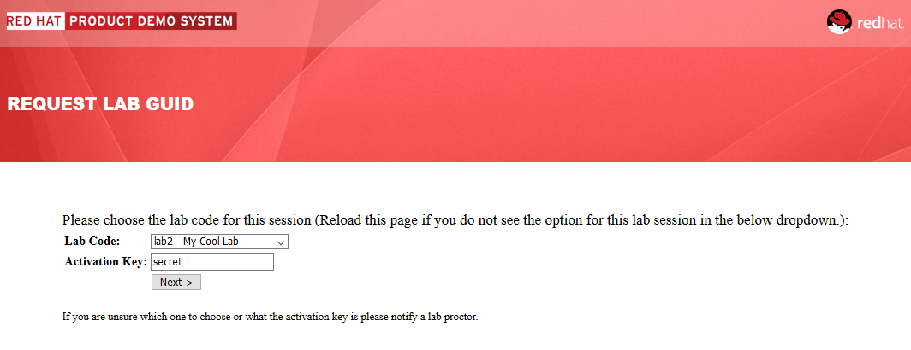
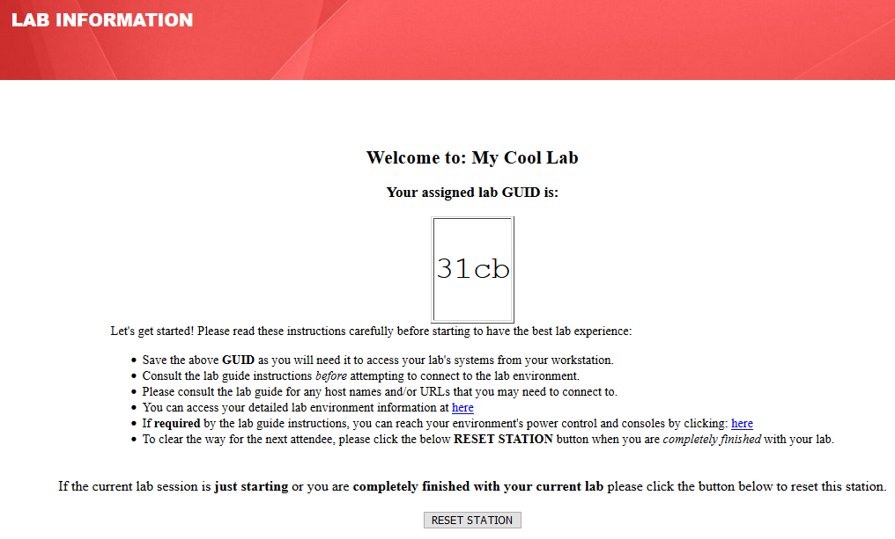

= GuidGrabber RHTE 2018 Attendee Quick Start Guide - Dedicated Environment

This document explains how to access the GuidGrabber in order to obtain a GUID.  This GUID will be used to access the lab environment.

. Begin by going to http://bit.ly/rhte-gg
+

. From this page select the proper *Lab Code* for the current lab.  Consult the lab proctor if you require this information.

. Enter the *Activation Key* provided by the lab proctor.

. Click *Next*.

. The resulting page will display your lab's GUID and other useful information about your lab environment.
+

. When you are completely done with your lab environment, please click *Reset Workstation* so that you can move on to the next lab.  If you fail to do this, you will be locked into the GUID from the previous lab.
+
[NOTE]
Clicking *Reset Workstation* will not stop or delete the lab environment.
