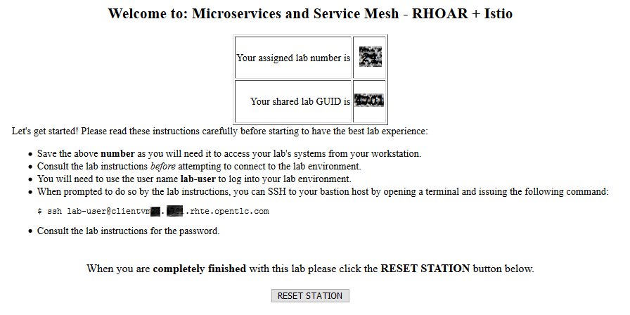
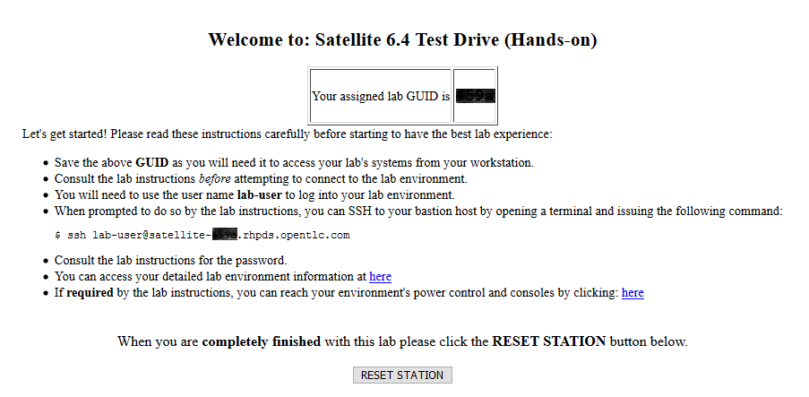

:noaudio:

ifdef::revealjs_slideshow[]

[#cover,data-background-image="image/1156524-bg_redhat.png" data-background-color="#cc0000"]

== &nbsp;

[#cover-h1]
Red Hat Tech Exchange

[#cover-h2]
GUID Grabber Slides to be used

[#cover-logo]
image::{revealjs_cover_image}[]

endif::[]

:scrollbar:
:data-uri:
:noaudio:
== GUID Grabber Reference (Reference only, not for students)

GPTE is providing an application that streamlines the process of providing lab information to your lab attendees called GuidGrabber.  The configuration file for this is at: https://docs.google.com/spreadsheets/d/1rMKhveEvjRcamPBHT4Nx78SbBuoCQ5u5qrDdE1yPgoo/edit#gid=0

. Column C is an activation key that you will have to share with your lab attendees.  You can change this or keep what is there.  Please keep it unique from all the other activation keys.  On lab day, you will share this key up on the screen so users can get their lab information.
. Column D (Ravello Only) This is the bastion host that will be shown to your attendees on the lab information page.  Please update this with the host name pattern you wish attendees to SSH into.  The keyword REPL will be replaced with the GUID for each user.  For example: workstation-REPL.rhpds.opentlc.com.
. Column E is an HTML link to your lab instructions.  Please update this as soon as possible.  This link will also appear on the lab information page.
. AWS dedicated and Ravello lab developers should provide a link to the GuidGrabber dedicated end user documentation in their lab instructions here: https://github.com/RedHatDemos/RHTE-2018/blob/master/GG/gg-dedicated.adoc
. AWS Based Shared developers should provide a link to the GuidGrabber shared end user documentation in their lab instructions here: https://github.com/RedHatDemos/RHTE-2018/blob/master/GG/gg-shared.adoc
. Finally, in your lab instructions all external SSH access to the bastion host for all labs will be as follows:
* Username: lab-user
* Password: r3dh4t1!
. Internal SSH access will be as you configured it when you developed your lab.

:scrollbar:
:data-uri:
:noaudio:
== To Do for Lab Owners

. Pick two of the next 6 slides
. Double Check your lab works like this
. Add at the very end of your presentation

:scrollbar:
:data-uri:
:noaudio:
== GUID Grabber - Shared Environment

Access the GUID Grabber in order to obtain a user name for the shared environment. You will log in as this user to access the lab environment.

. Begin by going to http://bit.ly/rhte-guidgrabber
. From this page select the proper Lab Code for the current lab.
. Enter the Activation Key provided by the lab proctor.
. Click *Next*
. The resulting page will display your lab’s user and other useful information about your lab environment.
. Click the link to open your Lab Instructions
. Follow the instructions on the page and in the lab instructions to connect to your environments
. When you are completely done with your lab environment, please click Reset Workstation so that you can move on to the next lab. If you fail to do this, you will be locked into the GUID from the previous lab.

:scrollbar:
:data-uri:
:noaudio:
== GUID Grabber - Shared Environment

image::images/ggs1.png[]

:scrollbar:
:data-uri:
:noaudio:
== GUID Grabber - Dedicated Environment

Access the GUID Grabber in order to obtain a GUID. This GUID will be used to access the lab environment.

. Begin by going to http://bit.ly/rhte-guidgrabber
. From this page select the proper Lab Code for the current lab.
. Enter the Activation Key provided by the lab proctor.
. Click *Next*
. The system will assign you a GUID (a 4 character alphanumeric code)
. Click the link provided to open your Lab Instructions
. Follow the instructions on the page and in the lab instructions to connect to your environments
. When you are completely done with your lab environment, please click Reset Workstation so that you can move on to the next lab. If you fail to do this, you will be locked into the GUID from the previous lab.

:scrollbar:
:data-uri:
:noaudio:
== GUID Grabber - Dedicated Environment

image::images/ggs1.png[]

:scrollbar:
:data-uri:
:noaudio:
== GUID Grabber - Shared Cluster (A1006)

You need to get a *User ID* from the GUID Grabber

. Begin by going to http://bit.ly/rhte-guidgrabber
. From this page select the proper Lab Code for the current lab.
. Enter the Activation Key provided by the lab proctor.
. Click Next.
. The system will assign you a Student Number (a number between 1 and 150)
. Your User Name for the Shared Clusters is user + the Student number
* e.g. *user133*
* Your Password is *r3dh4t1!*
. Click the link provided to open your Lab Instructions
. When you are completely done with your lab environment, please click Reset Workstation so that you can move on to the next lab. If you fail to do this, you will be locked into the GUID from the previous lab.

:scrollbar:
:data-uri:
:noaudio:
== GUID Grabber - Shared Cluster (A1006)

image::images/ggs1.png[]
image::images/ggsharedcluster.png[]